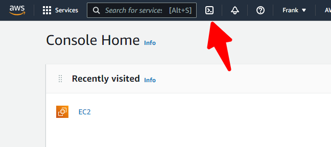

The AWS Command Line Interface is a command line tool that enables you to perform all AWS actions that you can do from the AWS Web Console directly from your a command line.

AWS CLI is a -very- elaborate tool. For help on using the tool please refer to the [User Guide](https://docs.aws.amazon.com/cli/latest/userguide/) and to the [Reference Guide](https://awscli.amazonaws.com/v2/documentation/api/latest/index.html)

There are two distinct ways in which to access the AWS command line interface (the 'aws' command)

## 1. Through the website

By far the easiest way to log in to the AWS console is through a so-called Cloud Shell. First log in to the AWS console on the web. Then, after making sure you are in the correct region (usually Frankfurt: *eu-central-1*), click on the CloudShell icon:



## 2. Directly from your laptop or desktop computer

If you want to be able to use the AWS cli without using a browser (so that you can for instance run AWS commands as part of your own scripts), you will need to set up the cli environment on your own machine

1. Install the software.

    Follow the instructions on <https://docs.aws.amazon.com/cli/latest/userguide/getting-started-install.html> in order to install the software on your machine. Linux, Windows and MacOS are supported.

2. Set up Single Sign On (SSO).

    Full instructions can be found here: <https://docs.aws.amazon.com/cli/latest/userguide/cli-configure-sso.html>.

    TL;DR
    ```
    $ aws configure sso
    SSO start URL [None]: https://tudelft.awsapps.com/start
    SSO region [None]: eu-west-1
    ```
    ... and follow the instructions. You can now log in with your NetID. We recommend you select `eu-central-1` as your default region (this is independent from the above value for 'SSO region', which needs to be `eu-west-1`)

    An SSO session times out after 4 hours. You can start a new session with:
    ```
    aws sso login
    ```

    We strongly recommend you specify the `eu-central-1` region.
