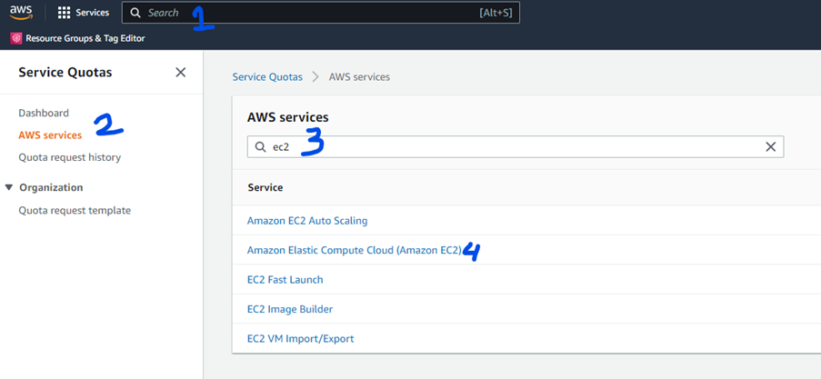
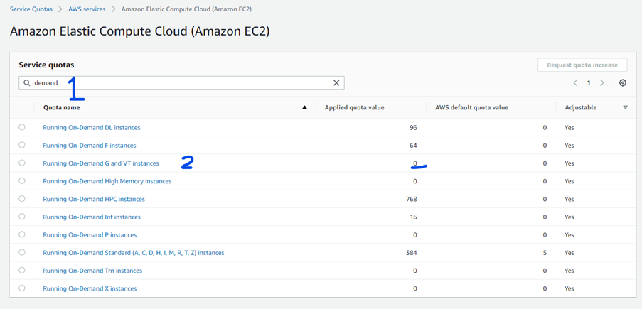
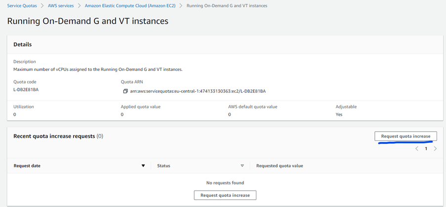

Your AWS account initially comes with default quotas that are rather limited. This is to prevent you from unknowingly spending more than you intend. However, for some situations these quotas are too limiting. A quota boundary you are likely to hit is the fact that there are no GPU machines available to launch in EC2.

Luckily, you can easily manage your quotas so that this restriction is removed.

An important note is that quotas are administered per AWS region. This means that if you for instance change your quotas in the Frankfurt region (eu-central-1), they will not be changed in other regions. You need to change the quotas in each region seperately.

Common resource limits you are likely to increase are:
-	GPU machines
-	Elastic IPs

In order to adapt quotas, do the following:
1. Type "quota" in the search box and select “Service Quotas” from the search results
2.	On the left hand side of the screen, select the menu item 'AWS services'
3.	In the 'Find services' box, type part of your service name (**ec2** in this example) 
4.	From the resulting service list, select the one that you need (**Amazon Elastic Compute Cloud (Amazon EC2)** in this example)

After selecting the service, you are presented with all quota settings that apply to that service. This overview can be quite overwhelming (a whopping five pages for EC2). Finding the correct name is an art in itself and often not trivial. If you need help with this, please contact us (<{{site.data.naming.teammail}}>).

For the example in this FAQ, we want to be able to use on-demand ec2 instances that provide GPU's, so we type the term **demand** in the 'Find quotas' box:

Observe that quotas for **Running On-demand G and VT instances** are set to zero. Select this option and, on the resulting details page, click on the 'Request quota increase' button.

Selecting the button presents you with a screen where you can specify the new quota value for the selected quota. In this case, you would enter the number of G-type instances of machines that you would like to have available in your account, in the current region.

Handling of the quota change is done by AWS, and usually works quite fast (less than one working day). Be aware though, that there is not one set procedure for all types of quotas. Some of the options (for instance upping the quota on reserved instances) will cost money to increase, so AWS will contact us (and we will contact you) before applying it. Again, when in doubt contact us (<{{site.data.naming.teammail}}>) and we will do our best to assist you with this!